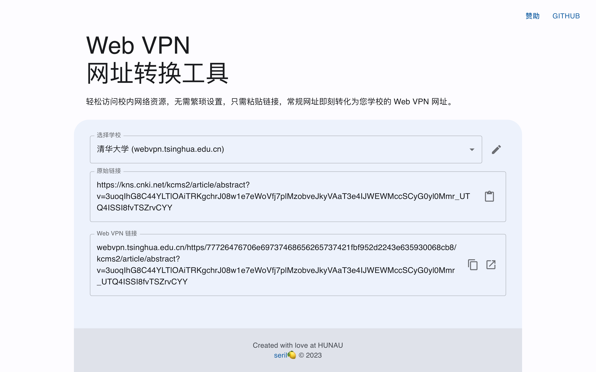

# Web VPN <br>网址转换工具

轻松访问校内网络资源，无需繁琐设置，只需粘贴链接，常规网址即刻转化为您学校的Web VPN网址。

**立刻使用：[https://wrdvpn.vercel.app/](https://wrdvpn.vercel.app/)**



## 功能

- 轻松转换 URL
- 丰富的预设学校数据
- 可定制的加密密钥
- 为大学生量身定制的活力主题
- 兼容各种设备的响应式界面

## 支持的学校


| 安徽                 | 北京                      | 福建                | 甘肃                    | 广东                   |
|----------------------|--------------------------|---------------------|--------------------------|------------------------|
| 中国科学技术大学   | 北京农学院          | 厦门大学         | 甘肃政法大学         | 广州医科大学          |
| 皖南医学院           | 清华大学                | 福建中医药大学 | 甘肃农业大学         | 肇庆学院                 |
| 合肥工业大学       | 北京外国语大学      |                         | 西北师范大学         | 广州大学                |
| 铜陵学院             | 中国人民大学          |                         | 兰州工业学院         | 韩山师范学院          |
| 皖西学院             | 北京邮电大学          |                         |                         | 广东海洋大学          |
| 阜阳师范大学       | 北京石油化工学院   |                         |                         |                            |
| 安徽医科大学       | 北京师范大学        |                         |                         |                            |

| 广西                 | 海南                   | 河北                | 河南                    | 湖北                   |
|----------------------|-----------------------|---------------------|--------------------------|-----------------------|
| 桂林航天工业学院   | 海南大学            | 河北环境工程学院 | 洛阳师范学院         | 黄冈师范学院          |
| 河池学院             |                            | 河北医科大学      | 郑州轻工业大学      | 汉江师范学院         |
|                      |                            | 中国人民警察大学 | 郑州航空工业管理学院 | 湖北警官学院         |
|                      |                            | 河北地质大学      |                         | 武汉理工大学         |
|                      |                            | 东北大学秦皇岛分校 |                           | 华中师范大学         |
|                      |                            | 河北大学          |                           | 湖北大学                |
|                      |                            | 河北农业大学      |                           |                           |
|                      |                            | 河北对外经贸职业学院 |                         |                           |

| 湖南                 | 江苏                   | 吉林                | 辽宁                    | 宁夏                   |
|----------------------|-----------------------|---------------------|--------------------------|------------------------|
| 邵阳学院             | 南京工程学院          | 吉林大学          | 渤海大学                | 宁夏大学                |
| 湖南科技大学       | 江苏大学               | 长春人文学院      | 大连理工大学           |                           |
| 湖南农业大学       | 河海大学                |                         | 沈阳工程学院           |                           |
| 吉首大学             | 无锡学院               |                         | 大连工业大学           |                           |
| 树达学院             | 常熟理工学院        |                         | 沈阳农业大学           |                           |
| 湖南大学             | 苏州城市学院         |                         | 沈阳建筑大学           |                           |

| 山东                 | 上海                   | 陕西                | 四川                    | 天津                   |
|----------------------|-----------------------|---------------------|--------------------------|-----------------------|
| 山东外国语职业技术大学 | 上海海事大学          | 西安航空学院       | 西华师范大学           | 南开大学                |
| 枣庄学院             | 复旦大学                | 西安科技大学       | 四川师范大学           | 天津城建大学           |
| 济南大学             | 东华大学                | 西安交通大学       | 四川传媒学院           | 天津城建大学（教师） |
| 山东青年政治学院   | 上海工程技术大学   | 西安财经大学       |                         |                         |
| 山东科技大学       | 上海交通大学医学院 | 西安理工大学       |                         |                         |
| 济宁学院             |                         | 西安建筑科技大学 |                         |                         |
| 山东石油化工学院   |                         | 西安欧亚学院       |                         |                         |
| 山东财经大学       |                         | 西北大学           |                         |                         |
| 青岛大学             |                         | 安康学院           |                         |                         |
| 烟台大学             |                         |                         |                         |                         |
| 山东大学             |                         |                         |                         |                         |


| 云南                 | 浙江                   |                        |                         |                         |
|----------------------|-----------------------|---------------------|--------------------------|-----------------------|
| 云南大学             | 温州医科大学          |                        |                         |                         |
| 云南中医药大学     | 嘉兴学院               |                        |                         |                         |
| 玉溪师范学院       | 嘉兴南湖学院        |                        |                         |                         |
| 保山学院             | 中国美术学院        |                        |                         |                         |
|                        | 浙江学院               |                        |                         |                         |
|                        |                         |                        |                         |                         |

没有你的学校？你可以使用自定义功能，或提交 pull request 或 issue，来适配你的学校。

相关文件：[适配学校列表 list.txt](https://github.com/lcandy2/webvpn-converter/blob/main/data/db/list.txt)

## Development

```bash
git clone https://github.com/lcandy2/webvpn-converter.git
cd webvpn-converter
npm install
npm run dev
```

This will be running at `http://localhost:3000`.

## Api

This project's API consists of two parts: encryption (encrypt) and decryption (decrypt).

### Encrypt API

This API takes a raw URL and encrypts it into a Web VPN URL.

**URL** : `/api/encrypt`


### Decrypt API

This API takes a Web VPN URL and decrypts it back into a raw URL.

**URL** : `/api/decrypt`

### API Parameters

**Method** : `GET`

- `url` : [required] The raw URL to be encrypted or decrypted.
- `prehost` : [required] [only in encrypt] The URL prefix of the generated Web VPN URL.
- `key` : [optional] The key used for encryption, defaults to `wrdvpnisthebest!`.
- `iv` : [optional] The initialization vector used for encryption, defaults to `wrdvpnisthebest!`.

**Success Response** : 

```json
{
  "originalUrl": "school Web VPN URL",
  "url": "encrypted URL or decrypted URL",
  "key": "key used for decryption",
  "iv": "initialization vector used for decryption"
}
```

Note: When using this API, ensure that the encryption and decryption key and initialization vector are used correctly. If the key or initialization vector is incorrect, the URL may not be encrypted or decrypted successfully.

## 贡献

欢迎所有的贡献。

## Built With and Thanks

- [bit-webvpn-converter](https://github.com/spencerwooo/bit-webvpn-converter)
- [Next.js](https://nextjs.org/)
- [Material-UI](https://mui.com/)
- [Icons8](https://icons8.com/)

## License

This project is licensed under the MPL-2.0 License - see the [LICENSE.md](LICENSE.md) file for details.
